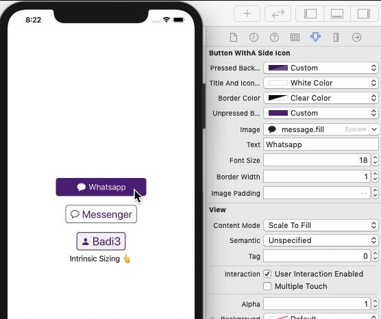

# ButtonWithASideIcon

An easy and convenient way to do buttons with side icons

## This is a Swift 5 version

## Adding to your project

Copy the `ButtonWithASideIcon.swift` file into your project.  Modify to fit your needs.

## License

This code is distributed under the terms and conditions of the [MIT license](LICENSE).
